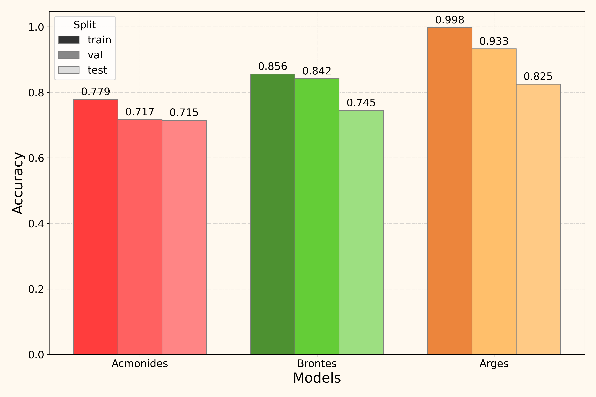

# Notes of Deep Learning with Applications
Repository of my notes for the course Deep Learning with Applications in UNIMI.

Contains the directories:
- [Appunti](#appunti)
- [Lab](#lab)
- [Lectures](#lectures)
- [Research](#research)

## Appunti
Personal notes of the lectures.

## Lab 
Notes and personal solution to exercises in class. 

## Lectures
Lectures' PDFs.

## Research
Implementation of three models for fundus camera image classification of retinal diseases. Along with the powerpoint presentation.

All trained models can be found at [this huggingface repo](https://huggingface.co/PhysGuy01/Polyphemus/tree/main).

